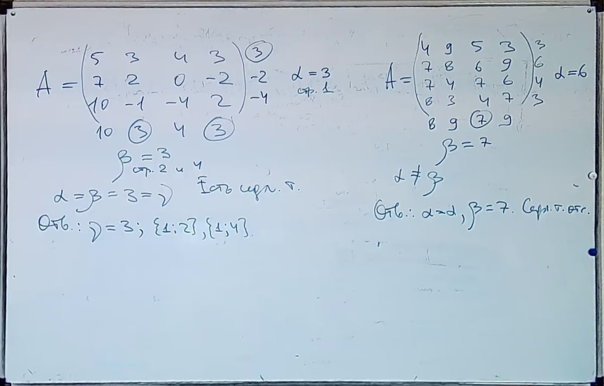
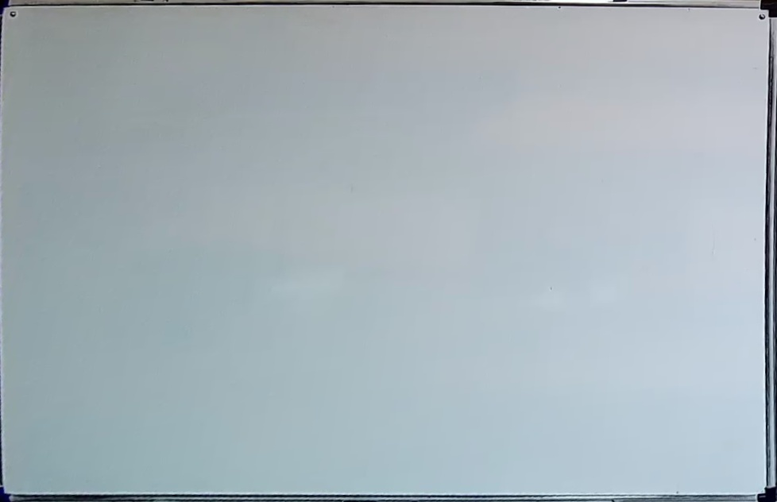

# wbd

Whiteboard detection experiments.

Crops and corrects perspective of whiteboard from image.

## Sample

**Original**

**Right board, cropped and perspecrive wrapped**

**Right board, after calibration**

**Left board, cropped and perspecrive wrapped**

**Left board, after calibration**

